# IKEA Product Price Analysis & Machine Learning

Python project analyzing IKEA product prices, product characteristics, statistical relationships, and machine learning price prediction.

## 🛠️ Tools

- Python
- Pandas
- NumPy
- Matplotlib
- Seaborn
- SciPy
- Statsmodels
- Scikit-learn

## 🔎 Analysis

The project includes:

- Data cleaning and preprocessing
- Exploratory Data Analysis
- Statistical hypothesis testing
- Pearson & Spearman correlation
- OLS regression
- Bootstrap confidence intervals
- Machine learning model comparison
- Hyperparameter tuning
- Cross-validation
- Feature importance analysis

## 📊 Dataset

Original dataset: [)

| Metric | Result |
|---|---:|
| Original products | 3,694 |
| Products after cleaning | 2,882 |
| Final columns | 19 |

## 📈 Key Findings

### Product Size & Price

| Metric | Result |
|---|---:|
| Pearson correlation | 0.6514 |
| Spearman correlation | 0.7026 |
| Pearson 95% Bootstrap CI | [0.6096, 0.6948] |
| OLS R² | 0.424 |
| Size coefficient | 1,067.08 |
| p-value | < 0.001 |

### Additional Colors & Price

| | Products | Median Price |
|---|---:|---:|
| Without additional colors | 1,604 | $457 |
| With additional colors | 1,278 | $658 |

Median difference: $201

- Mann–Whitney U p-value: 1.16 × 10⁻⁹
- Welch's t-test p-value: 1.30 × 10⁻⁵
- 95% Bootstrap CI for mean difference: [$112.98, $294.15]

## 🤖 Machine Learning

### Model Comparison

| Model | Mean CV R² | Std |
|---|---:|---:|
| Random Forest | 0.7356 | 0.0316 |
| Gradient Boosting | 0.6899 | 0.0302 |
| Linear Regression | 0.6338 | 0.0359 |

### Best Model

Random Forest Regressor

Best parameters:

```text
n_estimators = 200
max_depth = None
min_samples_leaf = 1

### Final Performance

| Metric | Result |
|---|---:|
| Best CV R² | 0.7384 |
| Test R² | 0.7442 |
| Test MAE | $349.81 |
| Test RMSE | $616.92 |
| CV R² Std | 0.0311 |

### Feature Importance

| Feature Group | Importance |
|---|---:|
| Width | 51.4% |
| Product series | 24.8% |
| Depth | 13.3% |
| Height | 8.8% |
| Additional colors | 1.8% |

## 📊 Visualizations

### Number of Products by Category

<p align="center">
  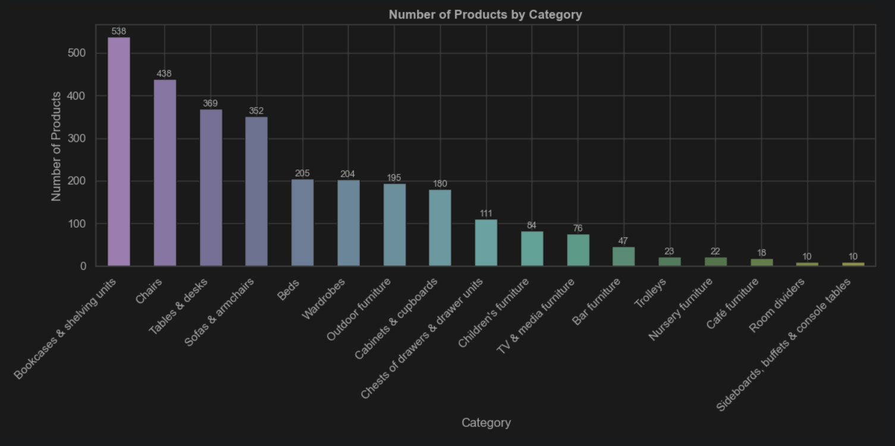
</p>

### IKEA Product Price Distribution

<p align="center">
  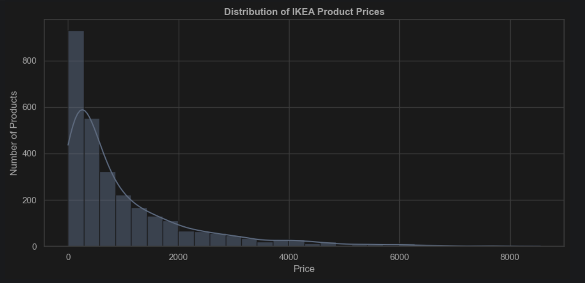
</p>

### Old Price vs Current Price

<p align="center">
  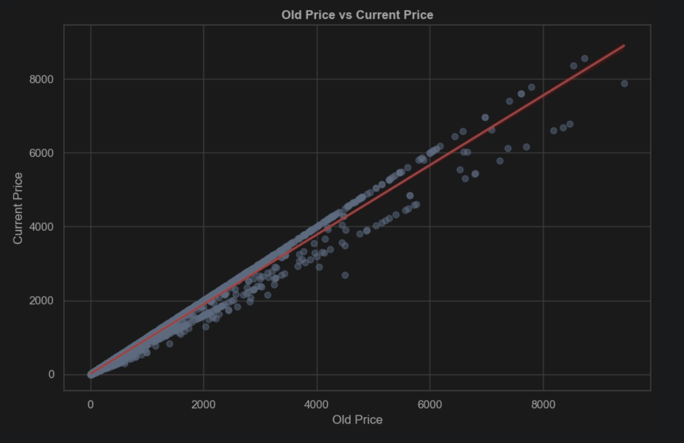
</p>

### Product Size vs Price

<p align="center">
  
</p>

### Price & Dimensions Correlation

<p align="center">
  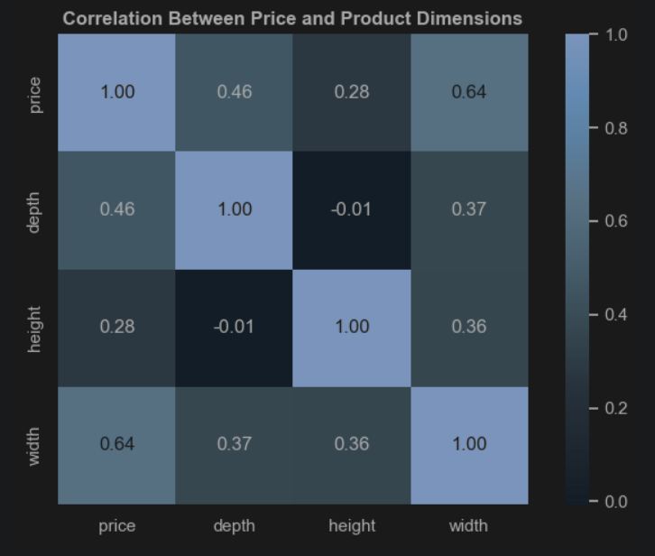
</p>

### Top 15 Designers by Number of Products

<p align="center">
  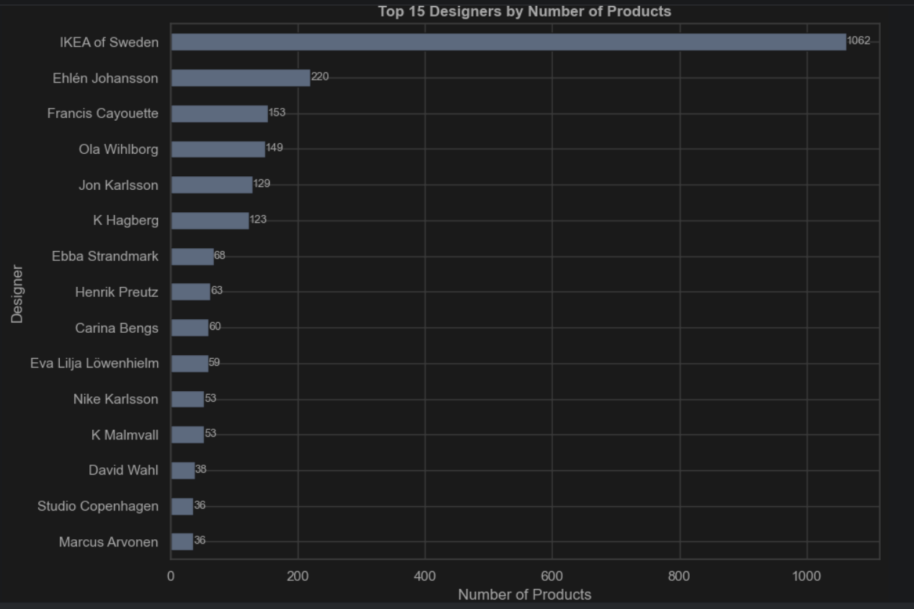
</p>

### Top 10 Product Series by Median Price

<p align="center">
  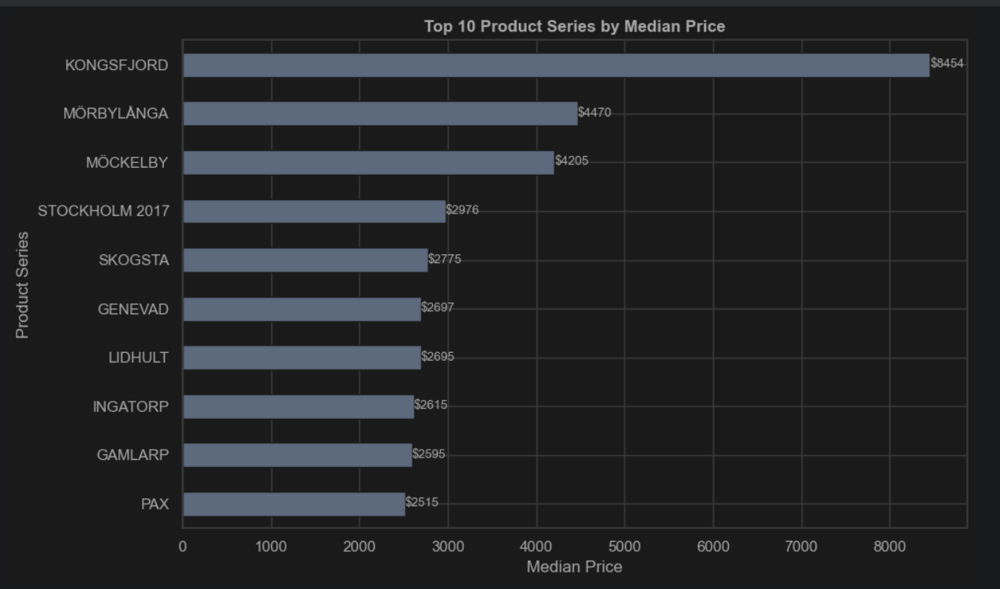
</p>

### Products and Median Price by Color Availability

<p align="center">
  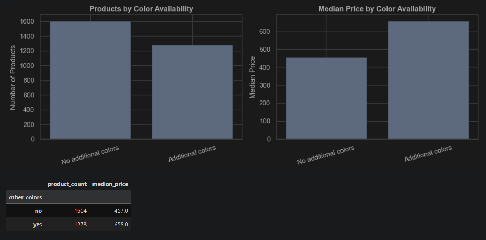
</p>

### Online vs Offline Products

<p align="center">
  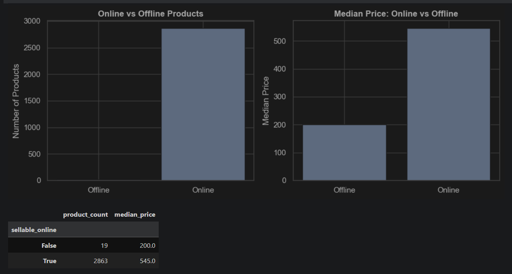
</p>

### Model Comparison — 5-Fold Cross-Validation

<p align="center">
  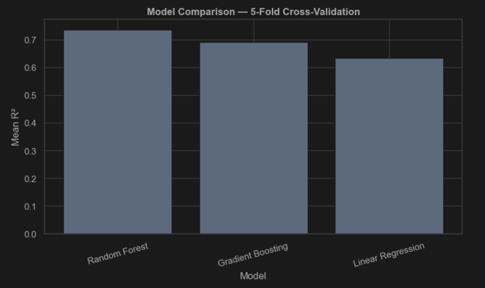
</p>

### Random Forest Cross-Validation

<p align="center">
  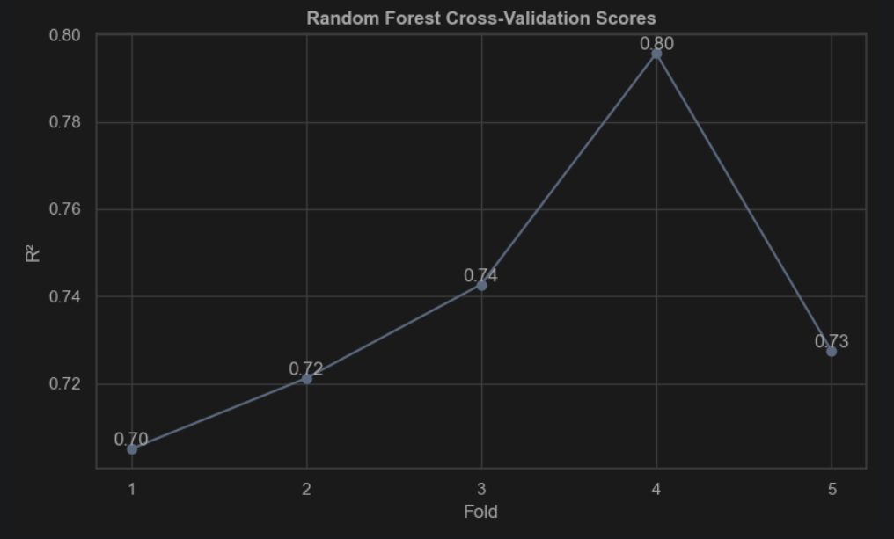
</p>

### Feature Importance

<p align="center">
  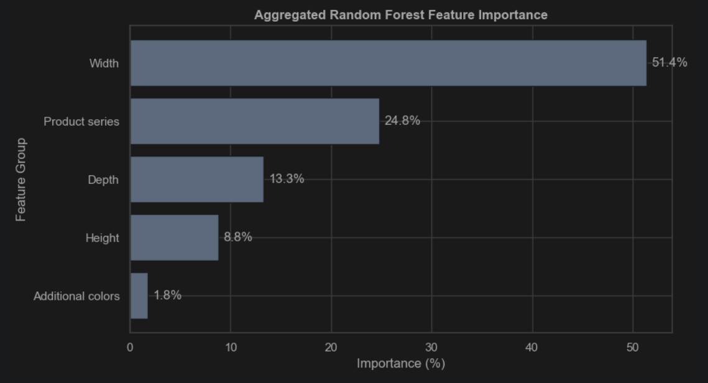
</p>

### Actual vs Predicted IKEA Product Prices

<p align="center">
  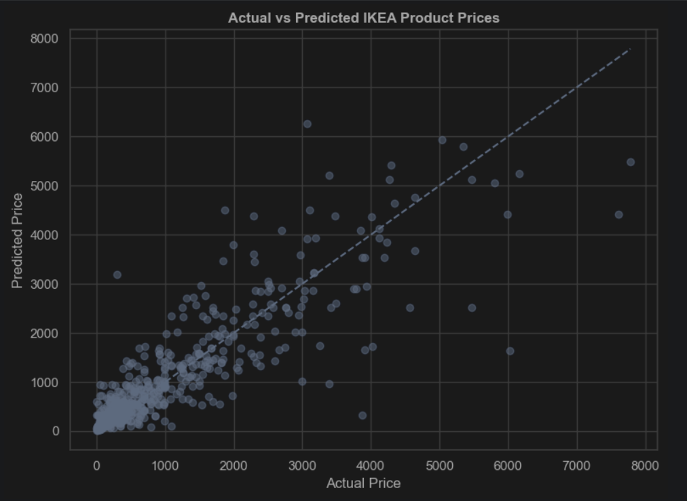
</p>
Feature importance
Actual vs predicted prices
